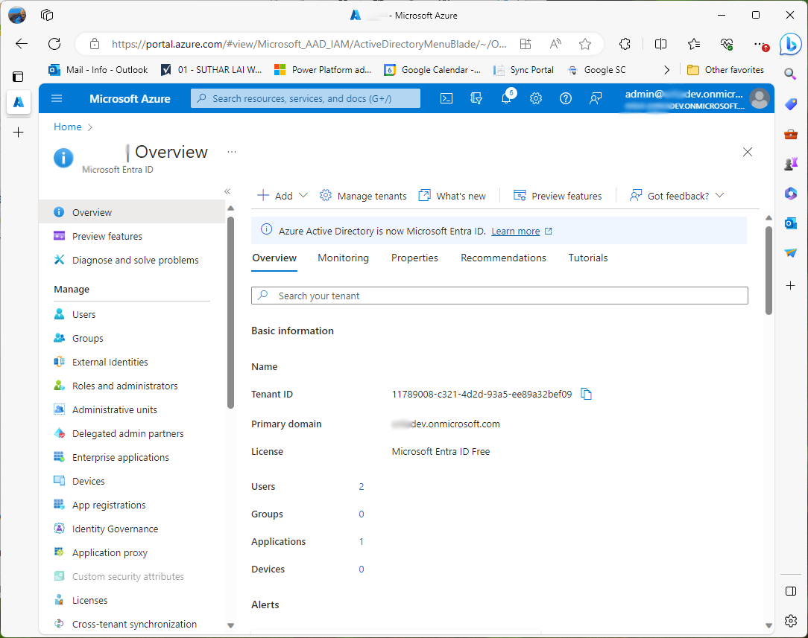
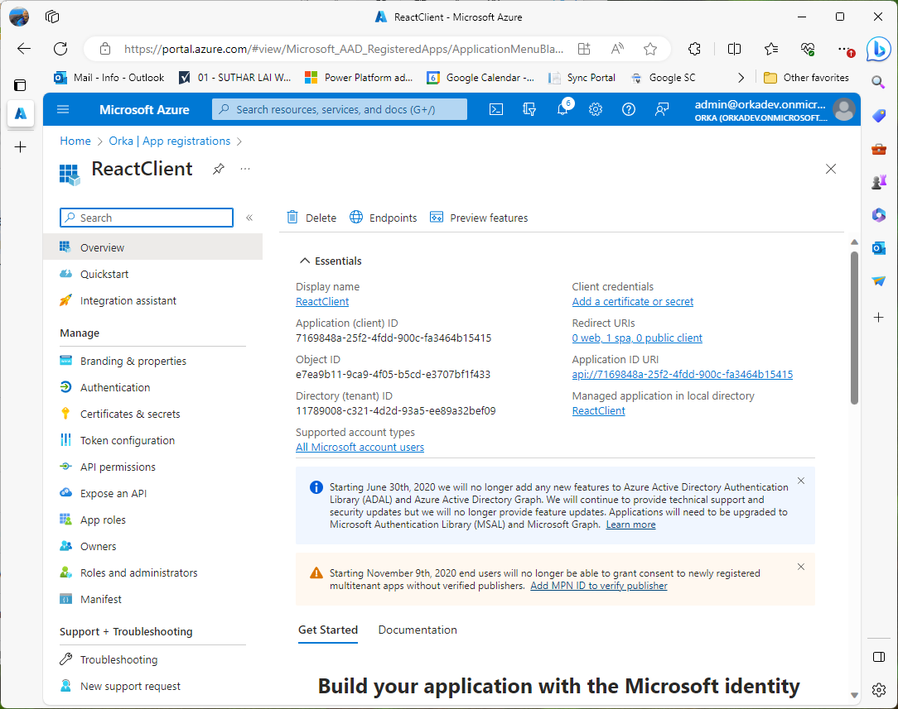
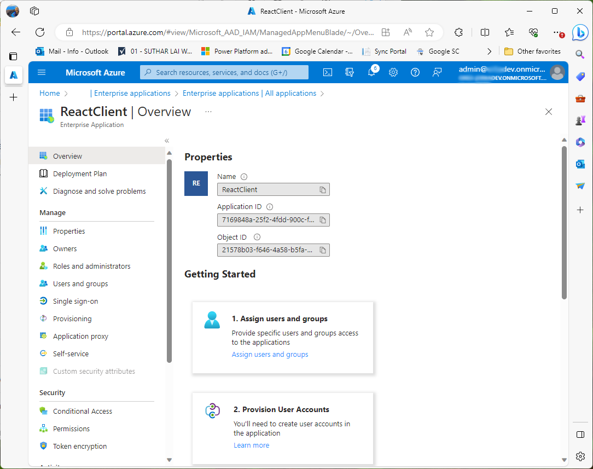
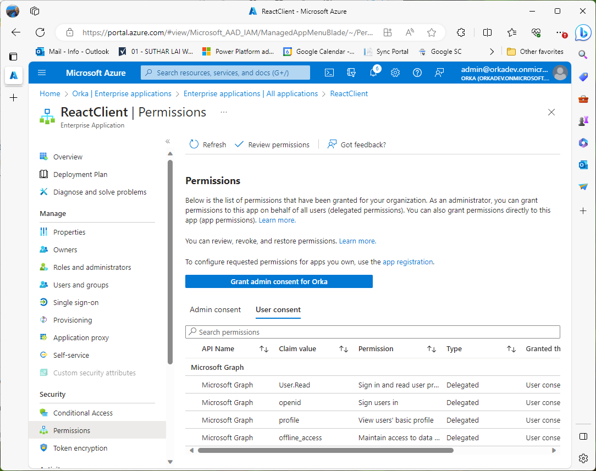

# Access an Azure AD-protected Spring Boot API after Signing In With React

## This sample demonstrates:
1. A React client app using [MSAL React](https://www.npmjs.com/package/@azure/msal-react) to acquire access and identity tokens
    * Platform: Single Page Application
    * Client: Public Client
    * Flow: Authorization Code Flow with PKCE
2. A Spring Boot resource server validating a passed identity token to protect am API endpoint

## Setup a simple React client to authenticate to Azure AD:
* https://learn.microsoft.com/en-us/azure/active-directory/develop/quickstart-single-page-app-react-sign-in

Here is the Azure AD tenant used in this sample (see [screenshots at the end](#key-aspects-of-the-azure-ad-configuration)):
1. tenant name: Orka
2. tenant domain: orkadev.onmicrosoft.com
3. tenant id: 11789008-c321-4d2d-93a5-ee89a32bef09
4. tenant admin: admin@orkadev.onmicrosoft.com

Here is information about the Azure AD application registered for this sample:
1. display name: ReactClient
2. supported account types: multi-tenant
3. redirect uri (SPA) http://localhost:3000/
4. app id (client id): 7169848a-25f2-4fdd-900c-fa3464b15415

## Set up a minimal Spring Boot controller:
For me, the *last 3 minutes* of this "Java Techie" video were helpful in setting up a minimal Spring Boot app.
* https://www.youtube.com/watch?v=7EhCzp3MhlQ&t=954s
* 00:00 - 14:35: not our scenario, but does walk through configuring an Azure Active Directory tenant
* 14:40 - 18:00: shows how to create a minimal Spring Boot project

This article *seems like* it would be helpful in setting up an Azure AD-protected resource server in Spring Boot:
* https://learn.microsoft.com/en-us/azure/developer/java/spring-framework/spring-boot-starter-for-azure-active-directory-developer-guide?tabs=SpringCloudAzure4x#protect-a-resource-serverapi

But, in the end, the <b>spring-cloud-azure-starter-active-directory</b> module contributes nothing to the resource server scenario. Everything is supported through the <b>spring-boot-starter-oauth2-resource-server</b> module. I ran into a wrinkle configuring Spring Boot CORS to allow the React Client to call its endpoint. Spring Security requires additional code to configure CORS. This code would have previously used WebSecurityConfigurerAdapter which has been deprecated in favor of the SecurityFilterChain model. When you add a "link to the chain", you disconnect everything else the chain was doing - such as oauth2ResourceServer support. So you need to understand a bit about what Spring Security is doing under the covers in order to configure CORS without breaking oauth2ResourceServer support.
* https://www.baeldung.com/spring-deprecated-websecurityconfigureradapter
* https://docs.spring.io/spring-security/reference/servlet/oauth2/resource-server/jwt.html

This is the Bean necessary to enable CORS and preserve Resource Server support.

    @Bean
    SecurityFilterChain filterChain(HttpSecurity http) throws Exception {
        // enable and configure CORS
        http.cors(cors -> cors.configurationSource(corsConfigurationSource(new String[]{"http://localhost:3000"})));
        // replicate (so we don't delete) default oauth2 resource server processing
        http.
            authorizeHttpRequests((authorize) -> authorize
                .anyRequest().authenticated()
            )
            .oauth2ResourceServer((oauth2) -> oauth2.jwt(Customizer.withDefaults()));
        return http.build();
    }
## Key aspects of the Azure AD Configuration
### The OrkaDev tenant
Log in to the [Azure Portal](https://portal.azure.com) with your OrkaDev tenant admin credentials and navigate to "Manage Microsoft Entra ID". This tenant contains the "App registration" for the "ReactClient" application. This tenant is also used by the Spring Boot application to validate tokens.
1. tenant name: Orka
2. tenant domain: orkadev.onmicrosoft.com
3. tenant id: 11789008-c321-4d2d-93a5-ee89a32bef09
4. tenant admin: admin@orkadev.onmicrosoft.com
 

### The Orka App Registration in the OrkaDev tenant
Navigate to "App registrations" and you should see a ReactClient entry. Select that entry and you should see the screenshot below. This is where you configure the ReactClient app. As you can see, there are no configured "Client credentials" because this is a Public Client application that can only perform authentication on behalf of a user and operate with delegated permissions conveyed by that user. Here is where you can configure delegated and application permissions (under API permissions) should you wish to empower this application to do more than just login. These permissions will show up in the token as claims that your app can use to make authorization decisions.

### The Orka Enterprise Application in the OrkaDev tenant
ReactClient is a *multi-tenant* application. This means that when you log into the ReactClient application, a Service Principal is created in your directory. That Service Principal in the OrkaDev tenant is the "Enterprise Application" in the screenshot below. This is where you can see the permissions that this app has in *your tenant*. Deleting this Enterprise Application will result in seeing the consent prompt next time you login with an OrkaDev account to the ReactClient application.

In this case we can see that the ReactClient Enterprise Application has minimal permissions in this tenant. These permissions are sufficient for just logging in and refreshing its access token but nothing more.

